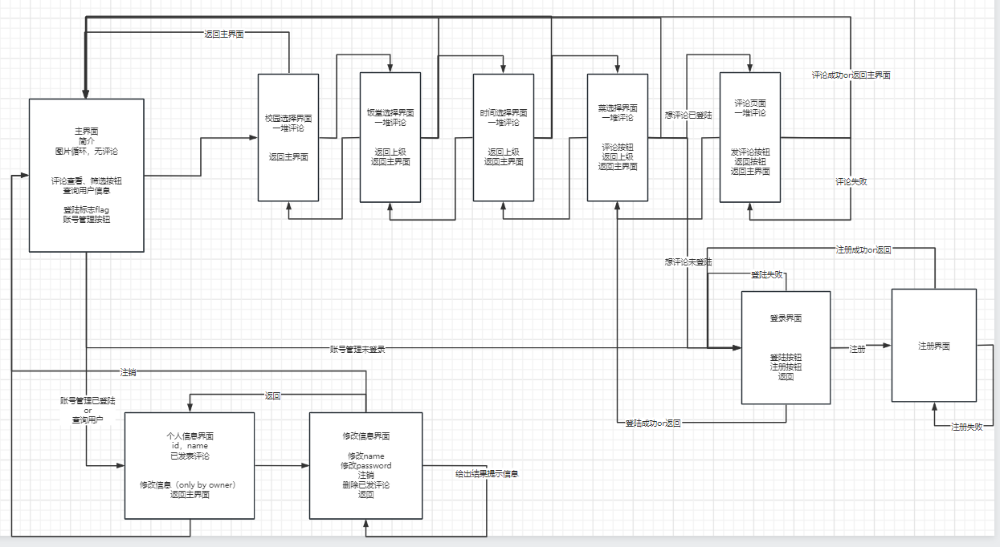

# 接口文档

### 已完成

- [x] sign_up
- [x] log_in
- [x] log_out
- [x] get_comment_by_dish 
- [x] get_some_comments
- [ ] add_commnet
- [ ] get_comment_by_campus
- [ ] list_cafeteria_name

### 待优化
1. 在 index.html 中增加了评论板块（见89行），注意不要更改变量名，如 comment_data 不能改。优化漂亮一点。
2. 主页的图片限制大小，大概到 1/2 处？
3. 在主页上方增加搜索按钮，跳转到搜索界面
4. 已经实现了**基于菜名**的模糊匹配，以及三个选项的选择。需要优化的是监听使得选择了校园后食堂处的选项内容为对应校园的。修改时同样注意不要更改变量名。（或者直接不管了，查不到就算了）
5. 对于搜索到的菜品还需要展示评论，这里和主页不同的是菜品要展示菜品详细信息，包括图片。所以可能需要考虑布局。
6. 登陆界面和注册界面一个英文一个中文？都中文吧
7. 我统一了登录和注册的命名（按接口文档），且 sign_up 和 log_in 之后都返回了一个 return_code，1 表示成功（见接口文档），可以试试看能不能获取到状态

### 用户
#### 1. register
- url: /sign_up
- method: POST
- 传入参数: username, password
- 返回值: 0-未操作, 1-成功，2-用户名已存在

#### 2. log_in
- url: /log_in
- method: POST
- 传入参数: username, passward
- 返回值: 0-未操作, 1-成功，2-用户名不存在或密码错误

#### 3. log_out
- url: /log_out
- method: 不需要
- 传入参数: 不需要
- 返回值：无

#### 4. change_name
- url: ?好像不需要
- method: 
- 传入参数
- 返回值

#### 5. change_password
- url: 
- method: 
- 传入参数
- 返回值

#### 6. destroy
- url: 
- method: 
- 传入参数
- 返回值

### 数据库信息
#### 7. get_comment_by_dish
- url: ？
- method: GET
- 传入参数: dish_name
- 返回值: score, content
- 状态：0-请求类型错误，1-菜品不存在，2-无评论

#### 8. get_campus_id_by_name
- url: 
- method: 
- 传入参数
- 返回值

#### 9. list_cafeteria_name
- url: 
- method: 
- 传入参数
- 返回值

#### 10. get_cafeteria_id_by_name
- url: 
- method: 
- 传入参数
- 返回值

#### 11. list_dish_name
- url: 
- method: 
- 传入参数
- 返回值

#### 12. get_dish_id_by_name
- url: 
- method: 
- 传入参数
- 返回值

#### 12. get_comment_by_campus
- url: 
- method: 
- 传入参数
- 返回值

#### 13. get_comment_by_cafeteria
- url: 
- method: 
- 传入参数
- 返回值

#### 14. get_comment_by_time
- url: 
- method: 
- 传入参数
- 返回值

#### 16. get_comment_by_userID
- url: 
- method: 
- 传入参数
- 返回值

#### 17. add_comment
- url: 
- method: 
- 传入参数
- 返回值

#### 18. del_comment
- url: 
- method: 
- 传入参数
- 返回值
