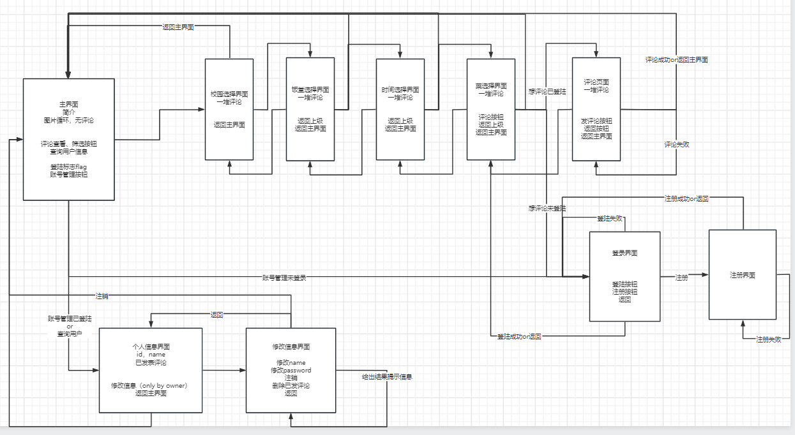

# 接口文档

### 用户
#### 1. sign_up
- url: /register
- method: POST
- 传入参数: username, password
- 返回值: 0-success, 1-用户名已存在

#### 2. log_in
- url: /login
- method: POST
- 传入参数: username, passward
- 返回值: 0-success, 1-用户名不存在或密码错误

#### 3. log_out
- url: 
- method: 
- 传入参数
- 返回值

#### 4. change_name
- url: ?好像不需要
- method: 
- 传入参数
- 返回值

#### 5. change_password
- url: 
- method: 
- 传入参数
- 返回值

#### 6. destroy
- url: 
- method: 
- 传入参数
- 返回值

### 数据库信息
#### 7. get_campus_id_by_name
- url: 
- method: 
- 传入参数
- 返回值

#### 8. list_cafeteria_name
- url: 
- method: 
- 传入参数
- 返回值

#### 9. get_cafeteria_id_by_name
- url: 
- method: 
- 传入参数
- 返回值

#### 10. list_dish_name
- url: 
- method: 
- 传入参数
- 返回值

#### 11. get_dish_id_by_name
- url: 
- method: 
- 传入参数
- 返回值

#### 12. get_comment_by_campus
- url: 
- method: 
- 传入参数
- 返回值

#### 13. get_comment_by_cafeteria
- url: 
- method: 
- 传入参数
- 返回值

#### 14. get_comment_by_time
- url: 
- method: 
- 传入参数
- 返回值

#### 15. get_comment_by_dish
- url: 
- method: 
- 传入参数
- 返回值

#### 16. get_comment_by_userID
- url: 
- method: 
- 传入参数
- 返回值

#### 17. add_comment
- url: 
- method: 
- 传入参数
- 返回值

#### 18. del_comment
- url: 
- method: 
- 传入参数
- 返回值